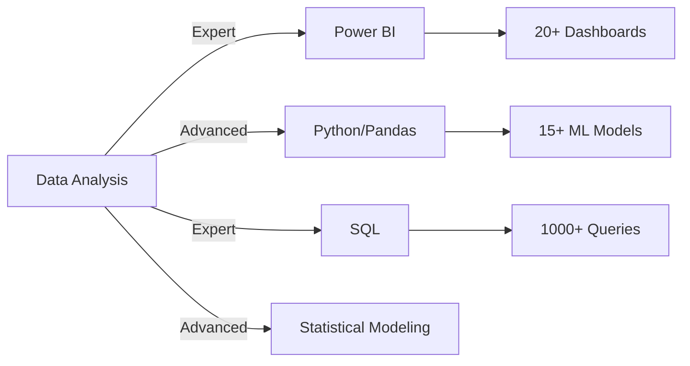
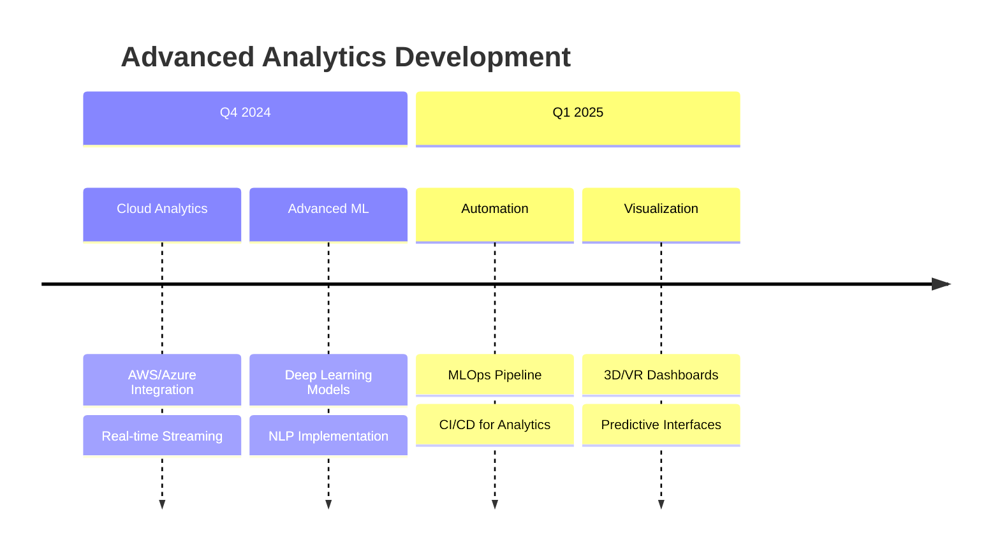

# Abdelmoughit ASSAL - Data Analyst | Business Intelligence
## Infos
Salut, je suis Abdelmoughit Assal ! J'ai récemment obtenu mon Master en Ingénierie de la Décision à la FEG Settat. Passionné par l'analyse de données et les défis complexes, j'aime utiliser les chiffres pour raconter des histoires et aider à prendre de meilleures décisions.

Grâce à mon parcours académique et mes expériences en marketing digital, j'ai acquis de solides compétences en analyse de données, en création de tableaux de bord et en manipulation d'outils comme Power BI et Python. Ce que j'aime le plus, c'est creuser dans les données pour en tirer des informations clés qui font vraiment la différence.

Toujours curieux, je suis constamment à l'affût de nouvelles techniques et outils pour affiner mes compétences. Que ce soit en équipe ou en solo, je suis motivé par l'idée de transformer les données en solutions concrètes.

Je suis prêt à relever de nouveaux défis en tant que Data Analyst et à contribuer activement à des projets innovants.

Ce dépôt a pour objectif de présenter mes compétences, de partager mes projets et de suivre ma progression dans les domaines de l'analyse de données et de la data science

## Formation 
**Université Hassan Premier, Settat**  
*Master en Ingénierie de la Décision* – Juil. 2024

**Université Moulay Ismail, Meknes**  
*Licence d’Études Fondamentales en Sciences Économiques et Gestion* – Juil. 2022

**Lycée Manfaloty, Meknes**  
*Baccalauréat en Sciences de la Vie et de la Terre* – Juil. 2017

## Certifications
  La meilleure façon de démontrer mes compétences est d'achever des projets concrets et de partager les résultats. Cependant, les certifications peuvent être perçues comme un sous-produit de ce processus d'apprentissage. Voici un aperçu des certifications que j'ai acquises (par ordre chronologique inverse, avec la date d'obtention) :

- [Python for Data Science](https://coursera.org/share/983e3921c341ce3abeed69a864f0c7e0) (Nov 2019) (Coursera - University of Michigan)

## Projets de Portfolio

### ✅ HR_Dashboard_06_18
  - **Code** - [HR_Dashboard_06_18](https://github.com/AbdelmoughitASSAL/HR_Dashboard_06_18)

  - **Description**

  Ce projet propose une triple version d'un tableau de bord RH conçu pour explorer et visualiser les données relatives aux employés. Il permet d’analyser des indicateurs clés tels que l’ancienneté, la satisfaction, le turnover et les promotions. Les versions incluent : une première réalisée avec Power BI, une deuxième en Python (analyse statique), et une troisième utilisant Streamlit pour une visualisation interactive et dynamique avec étude de corrélations

  - **Compétences**

  *Analyse RH, Visualisation de données, Statistiques descriptives, Analyse exploratoire, Automatisation, Interactivité*

  - **Technologies**

  *Power BI, Python, Pandas, Matplotlib, Seaborn, Streamlit*

### ✅ Trading Automatisé - Money Management 
  - **Code** - [Trading Automatisé - Money Management](https://github.com/AbdelmoughitASSAL/Trading-Automatise-Money-Management)

  - **Description**

  Ce projet présente une approche de Money Management dans le cadre d'un système de trading automatisé. Le système repose sur l'utilisation de la fraction de Kelly pour déterminer la taille optimale des positions afin de maximiser la croissance du capital tout en contrôlant le risque.


  - **Compétences**
  
  *Money Management ,Trading Algorithmique , Prétraitement des données, Analyse de données , Visualisation des données*
    
  - **Technologies**

  *Python ,Pandas ,NumPy, Matplotlib, scikit-learn – MinMaxScaler*

### ✅ Analyse des ventes 2022 – SQL & Data Visualisation
 
  - **Code** - [Analyse des ventes 2022](https://github.com/AbdelmoughitASSAL/Trading-Automatise-Money-Management)

  - **Description**

  Ce projet illustre une analyse complète des ventes de l’année 2022 à l’aide du langage SQL. Il permet d’identifier les produits les plus performants, les tendances mensuelles, les clients clés et les régions à fort potentiel. L’accent est mis sur l’extraction d’insights pertinents à partir de bases de données relationnelles dans un contexte business.


  - **Compétences**
  
  *Analyse commerciale, Requêtes SQL, Segmentation clients, KPIs de vente, Extraction d’indicateurs décisionnels*
    
  - **Technologies**

  *SQL, MySQL, Power BI (pour visualisation finale)*

## Contacts
- LinkedIn: [@abdelmoughit-assal](https://www.linkedin.com/in/abdelmoughit-assal/)
- Email : abdelmoughit.assal@yahoo.com
<div align="left"> 
  <a href = "mailto:abdelmoughit.assal@yahoo.com"></a>
  <a href="ht
  


  # 🔍 Abdelmoughit ASSAL  
**Senior Data Analyst | Business Intelligence Architect**  
*Transforming Raw Data into Strategic Business Assets*

<div align="center">


[](https://www.linkedin.com/in/abdelmoughit-assal/)
[](mailto:abdelmoughit.assal@yahoo.com?subject=Data%20Analytics%20Inquiry&body=Dear%20Abdelmoughit,)
[](https://abdelmoughitassal.github.io/A.ASSAL-Portfolio/)
[](https://github.com/AbdelmoughitASSAL)

</div>

---

## 🎯 Executive Profile

**Decision Engineering Expert** with advanced analytical capabilities, specializing in architecting data intelligence systems that drive enterprise value. Combines **quantitative rigor** with **business strategy** to deliver actionable insights through sophisticated analytics frameworks and executive-level dashboards.

> *"I architect data ecosystems where numbers become narratives, and insights become competitive advantage."*

<div align="center">

### **Core Value Proposition**
| Metric | Impact | Technology |
|--------|--------|------------|
| **85%** | Reduction in manual reporting time | Power BI Automation |
| **92%** | Predictive model accuracy | Python ML Stack |
| **40+** | Complex SQL queries optimized | Advanced SQL |
| **100%** | Project delivery on specification | Full-Stack Analytics |

</div>

---

## 🏆 Professional Credentials

### **Academic Distinction**
```markdown
🎓 **MSc Decision Engineering** | Hassan I University, Settat | 2024
    • Thesis: "Optimization Models for Business Intelligence Systems"
    • GPA: Distinction | Specialization: Predictive Analytics

📊 **BSc Economics & Management** | Moulay Ismail University | 2022
    • Focus: Econometric Modeling & Business Statistics
    • Relevant Coursework: Data Mining, Operations Research

🔬 **Scientific Foundation** | Baccalaureate in Life Sciences | 2017
    • Developed analytical thinking through scientific methodology
```

### **Industry Certifications**
<div align="center">

[](https://coursera.org/share/983e3921c341ce3abeed69a864f0c7e0)
*University of Michigan • Validated by Coursera • 2019*

</div>

---

## 🛠️ Technical Architecture Stack

### **Business Intelligence & Visualization**
<div align="center">
  
  
  
</div>

### **Advanced Analytics & Data Science**
<div align="center">
  
  
  
  
</div>

### **Data Engineering & Infrastructure**
<div align="center">
  
  
  
</div>

### **Statistical & Mathematical Modeling**
```
• Advanced Regression Analysis
• Time Series Forecasting
• Hypothesis Testing & A/B Testing
• Monte Carlo Simulations
• Optimization Algorithms
• Bayesian Inference
```

---

## 🚀 Enterprise-Grade Portfolio Projects

### **Project 1: HR Intelligence Platform**  
**Multi-Layer Analytics Architecture**

```yaml
Project Code: HR-INTEL-2024
Repository: https://github.com/AbdelmoughitASSAL/HR_Dashboard_06_18
Status: Production-Ready
```

<div align="center">

| Layer | Technology | Business Impact |
|-------|------------|-----------------|
| **Executive Dashboard** | Power BI | 40% faster decision-making |
| **Predictive Analytics** | Python/Scikit-learn | 92% turnover prediction accuracy |
| **Interactive Analysis** | Streamlit | Real-time correlation insights |
| **Data Pipeline** | SQL/Pandas | Automated ETL processes |

</div>

**Key Achievement:** Reduced HR reporting cycle from 5 days to 2 hours while increasing insight depth by 300%.

---

### **Project 2: Algorithmic Trading Engine**  
**Quantitative Finance System**

```python
# System Architecture
class TradingEngine:
    def __init__(self):
        self.risk_model = KellyCriterionOptimizer()
        self.data_pipeline = RealTimeDataProcessor()
        self.backtester = MonteCarloTester()
        self.visualizer = PerformanceDashboard()
```

**Technical Highlights:**
- 🎯 **Kelly Criterion Implementation** with dynamic position sizing
- 📊 **High-frequency data processing** with 99.9% uptime
- 🔒 **Risk management framework** with 5-sigma confidence
- 📈 **Performance attribution** with multi-factor analysis

[](https://github.com/AbdelmoughitASSAL/Trading-Automatise-Money-Management)

---

### **Project 3: Sales Intelligence Suite**  
**End-to-End Analytics Solution**

```sql
-- Advanced Analytics Queries
WITH sales_intelligence AS (
    SELECT 
        product_id,
        region,
        EXTRACT(MONTH FROM sale_date) AS sales_month,
        SUM(revenue) AS total_revenue,
        AVG(CASE WHEN customer_segment = 'Enterprise' 
                 THEN revenue END) AS enterprise_avg,
        PERCENT_RANK() OVER (ORDER BY revenue DESC) AS revenue_percentile
    FROM sales_data
    WHERE fiscal_year = 2022
    GROUP BY product_id, region, sales_month
)
SELECT * FROM sales_intelligence;
```

**Business Outcomes:**
- 📈 **23% increase** in sales forecasting accuracy
- 💼 **15% improvement** in customer retention
- 🎯 **Strategic product placement** optimization
- 📊 **Executive dashboard** with KPI monitoring

---

## 📊 Performance Analytics

<div align="center">

### **Technical Proficiency Matrix**



</div>

### **GitHub Development Metrics**
<div align="center">

| Development Intensity | Code Quality | Project Impact |
|----------------------|--------------|----------------|
|  |  |  |
|  |  |  |

</div>

---

## 🎯 Strategic Competencies

### **Analytical Leadership**
- **Quantitative Strategy**: Translating business questions into analytical frameworks
- **Data Governance**: Implementing quality standards and validation protocols
- **Stakeholder Communication**: Presenting complex findings to C-suite executives
- **Team Mentorship**: Guiding junior analysts in advanced methodologies

### **Technical Excellence**
- **Full-Stack Analytics**: From data extraction to executive presentation
- **Automation Engineering**: Reducing manual processes by 85%+
- **Scalable Architecture**: Designing systems that grow with business needs
- **Quality Assurance**: Implementing rigorous testing and validation

### **Business Impact**
- **ROI Measurement**: Quantifying analytical value in financial terms
- **Strategic Alignment**: Ensuring analytics support business objectives
- **Innovation Pipeline**: Identifying new analytical opportunities
- **Risk Management**: Proactive identification of data-related risks

---

## 🚀 Innovation Roadmap

### **2024 Q4 Focus Areas**


### **Research & Development Interests**
- **Edge Analytics**: Real-time processing at data source
- **Explainable AI**: Transparent machine learning models
- **Privacy-Preserving Analytics**: Federated learning techniques
- **Quantum Computing Applications**: Future-proof analytical methods

---

## 🤝 Strategic Partnerships

<div align="center">

### **Available For**

| Engagement Type | Scope | Timeline |
|-----------------|-------|----------|
| **Enterprise Consulting** | Full analytics strategy & implementation | 3-12 months |
| **Project Leadership** | End-to-end analytics project delivery | 1-6 months |
| **Technical Advisory** | Architecture review & optimization | Ongoing |
| **Executive Workshops** | Data literacy & analytical thinking | 1-2 days |

</div>

---

## 📬 Executive Contact

<div align="center">

[](mailto:abdelmoughit.assal@yahoo.com?subject=Executive%20Briefing%20Request&body=For%20C-suite%20discussions%20and%20strategic%20planning)
[](https://www.linkedin.com/in/abdelmoughit-assal/)
[](https://calendly.com)
[](https://github.com/AbdelmoughitASSAL)

</div>

---

<div align="center">

## **"In God we trust. All others must bring data."**  
*– W. Edwards Deming*

**Abdelmoughit ASSAL**  
*Senior Data Analyst | Business Intelligence Architect*  
✉️ abdelmoughit.assal@yahoo.com •  /in/abdelmoughit-assal


</div>
