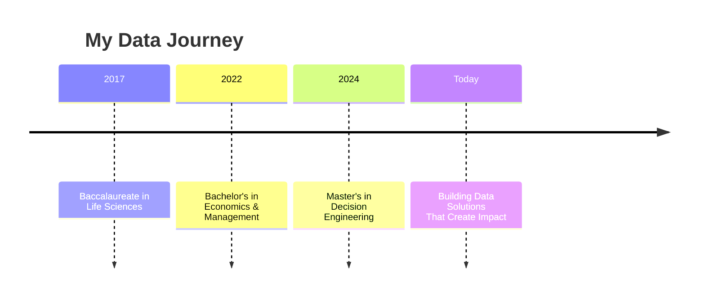
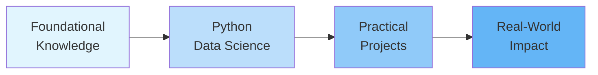
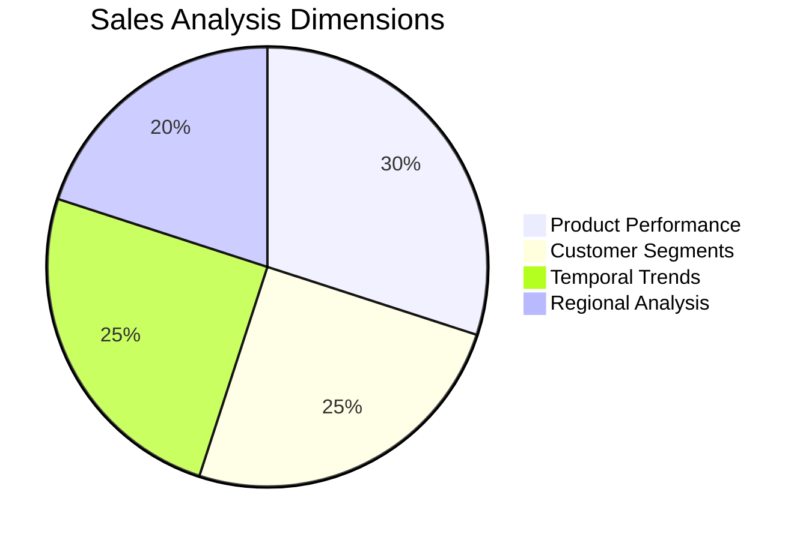
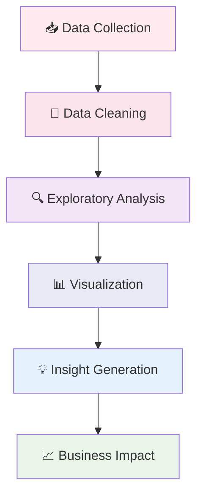

# ✨ Abdelmoughit ASSAL | Data Analyst & Business Intelligence Specialist

<p align="center">
  
</p>

---

## 🎯 **Professional Journey**

<div align="center">


```mermaid
timeline
    title My Data Journey
    2017 : Baccalaureate in<br>Life Sciences
    2022 : Bachelor's in<br>Economics & Management
    2024 : Master's in<br>Decision Engineering
    Today : Building Data Solutions<br>That Create Impact
```

</div>

## 🌟 **Why Data Analytics?**

<div align="center">
  
<p align="center">
  
</p>

| 📊 Raw Data | 🔄 | 📈 Insights | 🔄 | 💡 Decisions |
|-------------|---|--------------|---|----------|
| 🎯 Business Questions | 🔄 | 🧠 Analysis | 🔄 | 🚀 Solutions |

</div>

---

## 🎓 **Education Pathway**

<div align="center">
<p align="center">
  
</p>
</div>

| Institution | Degree | Year | Key Focus |
|------------|--------|------|-----------|
| **Hassan I University, Settat** | 🎖️ **Master's in Decision Engineering** | 2024 | *Optimization, Predictive Modeling, Business Intelligence* |
| **Moulay Ismail University, Meknes** | 📘 **Bachelor's in Economics & Management** | 2022 | *Economic Analysis, Statistical Methods, Market Dynamics* |
| **Manfaloty High School, Meknes** | 🧬 **Baccalaureate in Life Sciences** | 2017 | *Scientific Method, Analytical Thinking* |

---

## 🏆 **Certifications & Continuous Learning**

<div align="center">


```mermaid
graph LR
    A[Foundational<br>Knowledge] --> B[Python<br>Data Science]
    B --> C[Practical<br>Projects]
    C --> D[Real-World<br>Impact]
    
    style A fill:#e1f5fe
    style B fill:#bbdefb
    style C fill:#90caf9
    style D fill:#64b5f6
```

<p align="center">
  
</p>

**Latest Achievement:**  

[📜 View Certificate](https://coursera.org/share/983e3921c341ce3abeed69a864f0c7e0)

</div>

---

## 🚀 **Featured Projects Showcase**

<div align="center">
<p align="center">
  
</p>
</div>

### 🔍 **Project 1: HR Analytics Dashboard Suite**
```diff
+ Multi-Platform Solution | Real Employee Insights | Actionable HR Metrics
```

<div align="center">

| **Power BI** | **Python** | **Streamlit** |
|-------------|-----------|--------------|
| 📊 Interactive Dashboards | 🐍 Deep Analysis | 🌐 Web App |
| 👥 Stakeholder Reports | 📈 Advanced Visualizations | 🔍 Real-time Filters |
| ⚡ Fast Deployment | 🧮 Statistical Models | 🤝 User Interaction |

</div>

<div align="center">
<p align="center">
  
</p>
</div>

### 💹 **Project 2: Algorithmic Trading System**
```diff
+ Risk-Managed Trading | Kelly Criterion | Capital Growth Optimization
```

<div align="center">
  
<p align="center">
  
</p>

```
📈 Market Data → 🧠 Risk Analysis → ⚖️ Position Sizing → 📊 Performance Tracking
      ↓              ↓                  ↓                   ↓
   Raw Inputs  →  Risk Metrics  →  Optimal Bets  →  Growth Visualization
```

</div>

<div align="center">
<p align="center">
  
</p>
</div>

### 📊 **Project 3: Sales Intelligence Platform**
```diff
+ SQL-Powered Analysis | Multi-dimensional Insights | Executive Dashboards
```

<div align="center">


```mermaid
pie title Sales Analysis Dimensions
    "Product Performance" : 30
    "Customer Segments" : 25
    "Temporal Trends" : 25
    "Regional Analysis" : 20
```

</div>

<div align="center">
<p align="center">
  
</p>
</div>

---

## 🛠️ **Technical Arsenal**

<div align="center">
<p align="center">
  
</p>
</div>

<div align="center">

| **Category** | **Tools & Technologies** | **Proficiency** |
|--------------|-------------------------|----------------|
| 📊 **Visualization** | Power BI, Matplotlib, Seaborn, Plotly | ⭐⭐⭐⭐⭐ |
| 🐍 **Programming** | Python (Pandas, NumPy), SQL, DAX | ⭐⭐⭐⭐⭐ |
| 📈 **Analysis** | Statistical Analysis, EDA, Predictive Modeling | ⭐⭐⭐⭐☆ |
| 🗄️ **Databases** | MySQL, PostgreSQL, Data Modeling | ⭐⭐⭐⭐☆ |
| 🚀 **Deployment** | Streamlit, Git, Jupyter, Excel | ⭐⭐⭐⭐⭐ |

</div>

---

## 🌈 **My Analytical Philosophy**

<div align="center">

<p align="center">
  
</p>


```mermaid
graph TB
    A[📥 Data Collection] --> B[🧹 Data Cleaning]
    B --> C[🔍 Exploratory Analysis]
    C --> D[📊 Visualization]
    D --> E[💡 Insight Generation]
    E --> F[📈 Business Impact]
    
    style A fill:#ffebee
    style B fill:#fce4ec
    style C fill:#f3e5f5
    style D fill:#e8eaf6
    style E fill:#e3f2fd
    style F fill:#e8f5e8
```

</div>

---

## 📬 **Let's Connect & Collaborate**

<div align="center">
<p align="center">
  
</p>
</div>

<div align="center">

| **Platform** | **Link** | **Best For** |
|-------------|----------|-------------|
| 💼 **LinkedIn** | [@abdelmoughit-assal](https://www.linkedin.com/in/abdelmoughit-assal/) | Professional Networking |
| 📧 **Email** | abdelmoughit.assal@yahoo.com | Project Discussions |
| 🐙 **GitHub** | [@AbdelmoughitASSAL](https://github.com/AbdelmoughitASSAL) | Code Collaboration |

</div>

<div align="center">
  <a href="mailto:abdelmoughit.assal@yahoo.com">
    
  </a>
  <a href="https://www.linkedin.com/in/abdelmoughit-assal">
    
  </a>
  <a href="https://github.com/AbdelmoughitASSAL">
    
  </a>
</div>

---

<div align="center">

<p align="center">
  
</p>

*"Not just analyzing data, but architecting understanding"*

</div>

---

<details>
<summary>📈 View Activity Metrics</summary>

<br>

<div align="center">
<p align="center">
  
</p>
</div>

**Recent Project Activity:**
```bash
📁 Portfolio Updates:      ✅ Weekly
🧠 New Skills:            ⏳ In Progress
🚀 Project Deployments:   📅 Monthly
📚 Learning Hours:        15+/week
```

**GitHub Stats Preview:**
```
🎯 Commits this month:  25+
🌟 Projects Active:     3
🔄 Last Update:         Recent
📊 Languages:          Python, SQL, DAX
```

</details>

---

<div align="center">


</div>

---

<div align="center">
<p align="center">
  
</p>
</div>